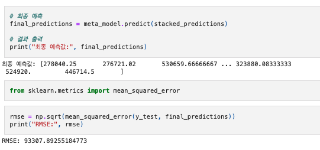
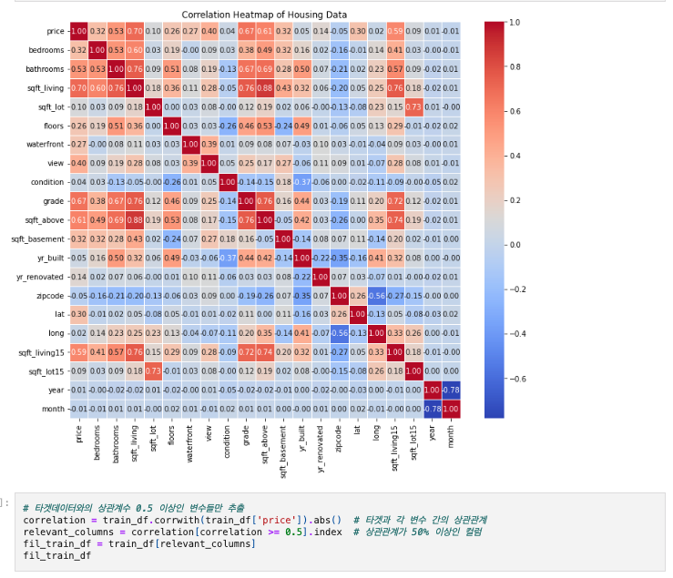
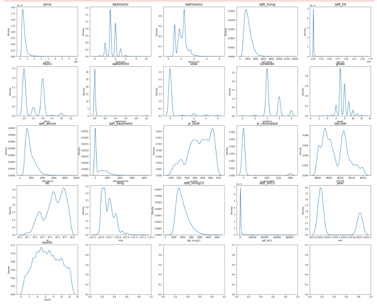

AIFFEL Campus Online Code Peer Review Templete

* 코더 : 오창원
* 리뷰어 : 나영진   
PRT(Peer Review Template)

*  1. 주어진 문제를 해결하는 완성된 코드가 제출되었나요?
    * 문제에서 요구하는 최종 결과물이 첨부되었는지 확인   
     
    최종 예측값 도출 완료 하였으나, 시간상 캐글 제출 후 결과갑 도출이 필요할것 같습니다.

* 
*  2. 전체 코드에서 가장 핵심적이거나 가장 복잡하고 이해하기 어려운 부분에 작성된 주석 또는 doc string을 보고 해당 코드가 잘 이해되었나요?
    * 해당 코드 블럭을 왜 핵심적이라고 생각하는지 확인
    * 해당 코드 블럭에 doc string/annotation이 달려 있는지 확인
    * 해당 코드의 기능, 존재 이유, 작동 원리 등을 기술했는지 확인
    * 주석을 보고 코드 이해가 잘 되었는지 확인
     
    Heatmap등 EDA 와 Feature selection을 잘 진행해 주셨습니다.
        
* 
*  3. 에러가 난 부분을 디버깅하여 문제를 해결한 기록을 남겼거나 새로운 시도 또는 추가 실험을 수행해봤나요?
    * 문제 원인 및 해결 과정을 잘 기록하였는지 확인
    * 프로젝트 평가 기준에 더해 추가적으로 수행한 나만의 시도, 실험이 기록되어 있는지 확인   
    말씀해 주신것 처럼, 피처 뿐만 아니라 타겟 데이터까지 스케일링을 하는게 좋은지 추가 실험을 통해 확인해보시면 좋을것 같습니다.

* 
*  4. 회고를 잘 작성했나요?
    * 주어진 문제를 해결하는 완성된 코드 내지 프로젝트 결과물에 대해 배운점과 아쉬운점, 느낀점 등이 기록되어 있는지 확인
    * 전체 코드 실행 플로우를 그래프로 그려서 이해를 돕고 있는지 확인
         
    그래프로 피처 분포를 잘 시각화 해주셨습니다.

* 

*  5. 코드가 간결하고 효율적인가요?
    * 파이썬 스타일 가이드 (PEP8) 를 준수하였는지 확인
    * 코드 중복을 최소화하고 범용적으로 사용할 수 있도록 함수화/모듈화했는지 확인
        * 중요! 잘 작성되었다고 생각되는 부분을 캡쳐해 근거로 첨부
    이해하기 쉽게 코드 작성 및 설명 해주셔서 이해하기 쉬웠습니다.

# 리뷰어의 회고를 작성합니다.   
# 코드 리뷰 시 참고한 링크가 있다면 링크와 간략한 설명을 첨부합니다.   
# 코드 리뷰를 통해 개선한 코드가 있다면 코드와 간략한 설명을 첨부합니다.   
파라미터 개선과 같은 추가 실험이 있었으면, 더 좋은 내용이 될것 같습니다.
