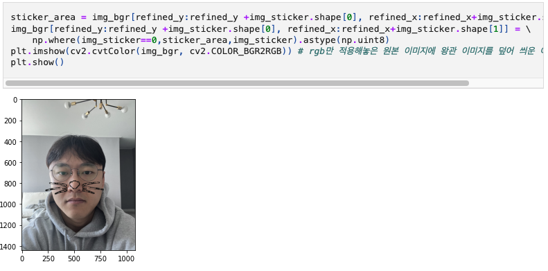
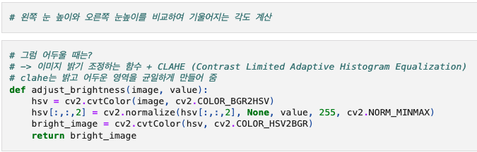
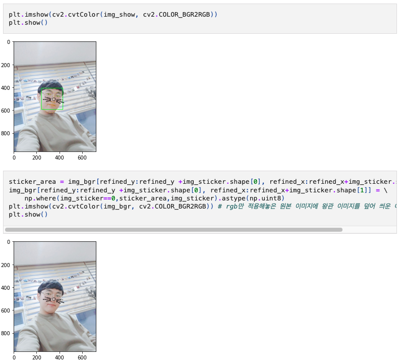
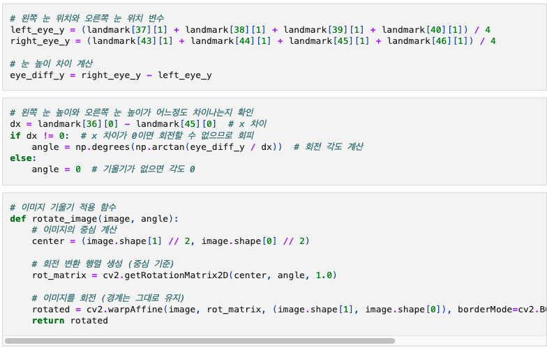
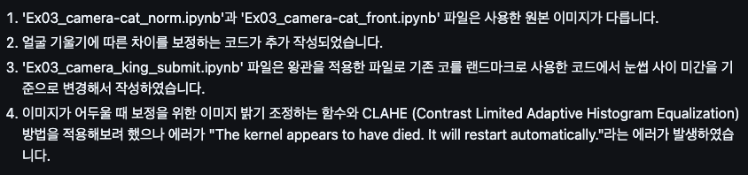
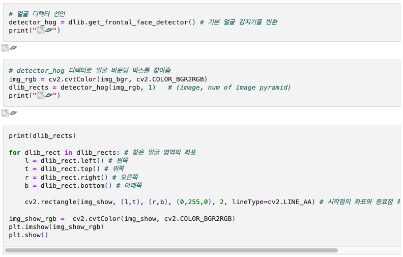

다소 충격적인 사진을 포함하고 있으니 심호흡 한번 깊이 하시고 코드를 봐주시기 바랍니다...
1. 'Ex03_camera-cat_norm.ipynb'과 'Ex03_camera-cat_front.ipynb' 파일은 사용한 원본 이미지가 다릅니다.   
2. 얼굴 기울기에 따른 차이를 보정하는 코드가 추가 작성되었습니다.   
3. 'Ex03_camera_king_submit.ipynb' 파일은 왕관을 적용한 파일로 기존 코를 랜드마크로 사용한 코드에서 눈썹 사이 미간을 기준으로 변경해서 작성하였습니다.   
4. 이미지가 어두울 때 보정을 위한 이미지 밝기 조정하는 함수와 CLAHE (Contrast Limited Adaptive Histogram Equalization) 방법을 적용해보려 했으나 에러가 "The kernel appears to have died. It will restart automatically."라는 에러가 발생하였습니다.

# AIFFEL Campus Online Code Peer Review Templete
- 코더 : 오창원
- 리뷰어 : 정상헌


# PRT(Peer Review Template)
- [X]  **1. 주어진 문제를 해결하는 완성된 코드가 제출되었나요?**
    - 올바른 위치에 고양이 수염을 위치시킨 것을 확인했습니다  
      
    
- [X]  **2. 전체 코드에서 가장 핵심적이거나 가장 복잡하고 이해하기 어려운 부분에 작성된 
주석 또는 doc string을 보고 해당 코드가 잘 이해되었나요?**
    - 주석을 적절하게 달아 코드를 처음 보는 사람들이 활용하기가 수월합니다  
        
        
- [X]  **3. 에러가 난 부분을 디버깅하여 문제를 해결한 기록을 남겼거나
새로운 시도 또는 추가 실험을 수행해봤나요?**
    - 얼굴의 각도와 사진의 밝기에 robust하게 하려는 시도를 하였습니다  
           
          
        
- [X]  **4. 회고를 잘 작성했나요?**
    - readme 파일에 기존 base 코드에 추가된 로직과 에러가 난 부분에 대한 설명이 잘 되어있습니다  
          
        
- [X]  **5. 코드가 간결하고 효율적인가요?**
    - 코드 작성이 깔끔해 가독성이 좋습니다  
        


# 회고(참고 링크 및 코드 개선)
```
고양이 수염의 회전을 반영하는 로직을 구현하신 것이 인상깊었습니다. 제 코드를 발전시키는데 좋은 참고가 될 듯합니다
고생 많으셨습니다 :)
```
