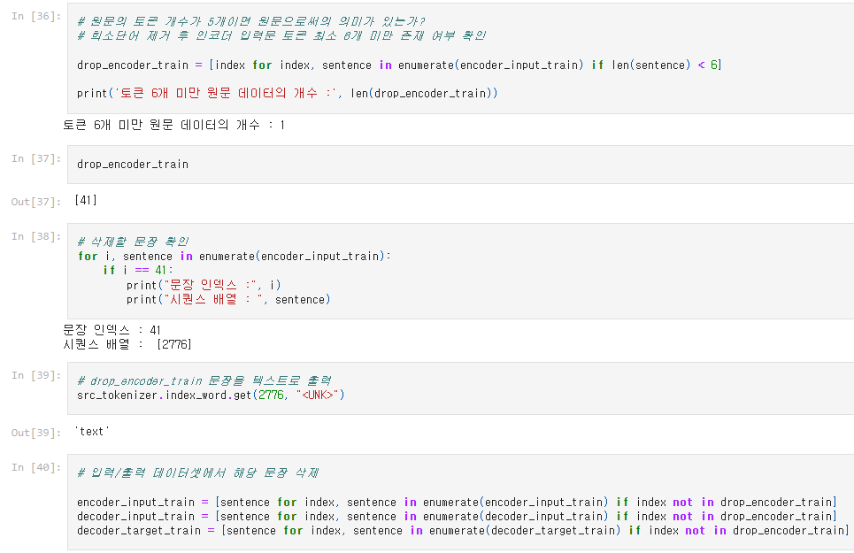
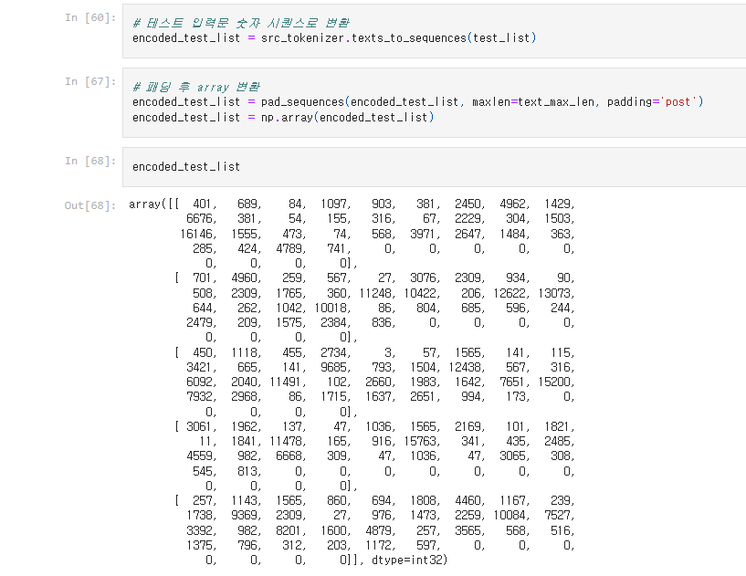
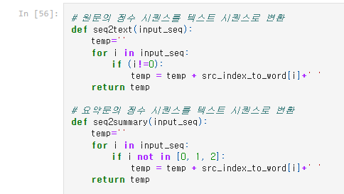

AIFFEL Campus Online Code Peer Review Templete

* 코더 : 오창원
* 리뷰어 : 노규범
PRT(Peer Review Template)

*  1. 주어진 문제를 해결하는 완성된 코드가 제출되었나요?
    * 문제에서 요구하는 최종 결과물이 첨부되었는지 확인
    * 

 
*  2. 전체 코드에서 가장 핵심적이거나 가장 복잡하고 이해하기 어려운 부분에 작성된 주석 또는 doc string을 보고 해당 코드가 잘 이해되었나요?
    * 해당 코드 블럭을 왜 핵심적이라고 생각하는지 확인
    * 해당 코드 블럭에 doc string/annotation이 달려 있는지 확인
    * 해당 코드의 기능, 존재 이유, 작동 원리 등을 기술했는지 확인
    * 주석을 보고 코드 이해가 잘 되었는지 확인
    * 
    * 이상치 정의와 이상치 탐지 방식을 잘 설명하였습니다.

 
*  3. 에러가 난 부분을 디버깅하여 문제를 해결한 기록을 남겼거나 새로운 시도 또는 추가 실험을 수행해봤나요?
    * 문제 원인 및 해결 과정을 잘 기록하였는지 확인
    * 프로젝트 평가 기준에 더해 추가적으로 수행한 나만의 시도, 실험이 기록되어 있는지 확인
    * 
    * 테스트 입력문 인풋이 에러가 나서 확인해보니 차원 문제로 패딩이 필요했다는걸 파악했다고 하셨습니다.

*  4. 회고를 잘 작성했나요?
    * 주어진 문제를 해결하는 완성된 코드 내지 프로젝트 결과물에 대해 배운점과 아쉬운점, 느낀점 등이 기록되어 있는지 확인
    * 전체 코드 실행 플로우를 그래프로 그려서 이해를 돕고 있는지 확인
    * 
    * 최종 결과에 대해 적절한 의미를 도출해내었습니다.

  
*  5. 코드가 간결하고 효율적인가요?
    * 파이썬 스타일 가이드 (PEP8) 를 준수하였는지 확인
    * 코드 중복을 최소화하고 범용적으로 사용할 수 있도록 함수화/모듈화했는지 확인
        * 중요! 잘 작성되었다고 생각되는 부분을 캡쳐해 근거로 첨부
        * 
        * 반복적으로 필요한 코드를 함수화하여 효율적으로 작성하였습니다.


# 회고(참고 링크 및 코드 개선)
```
문제 해결 과정이 논리적으로 잘 구성되었습니다. 핵심 코드 블록에 대한 주석이 적절하게 달려 있어 가독성이 높았고, 디버깅 과정에서 문제 원인을 명확히 파악하여 해결한 점이 인상적이었습니다.
추상적 요약의 성능 한계의 이유에 대해 lstm의 한계라고 자신만의 결론을 도출한 점이 인상적입니다.
```

