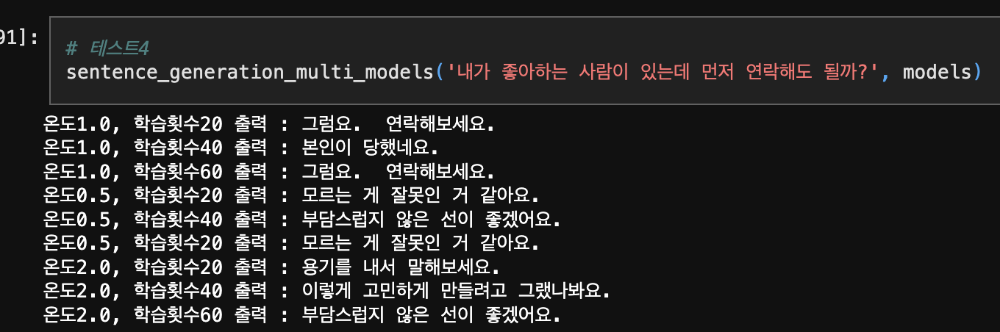
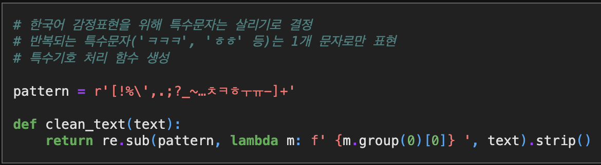
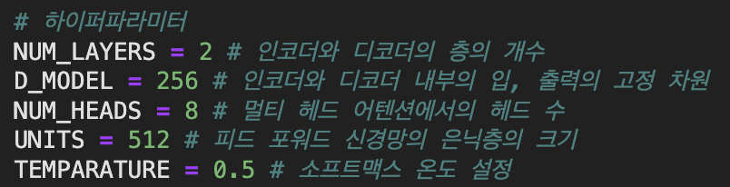
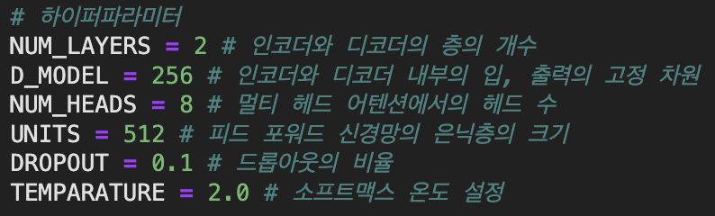
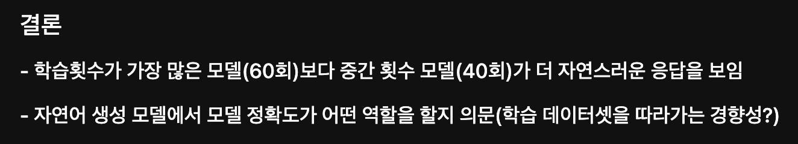
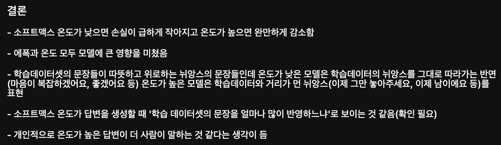
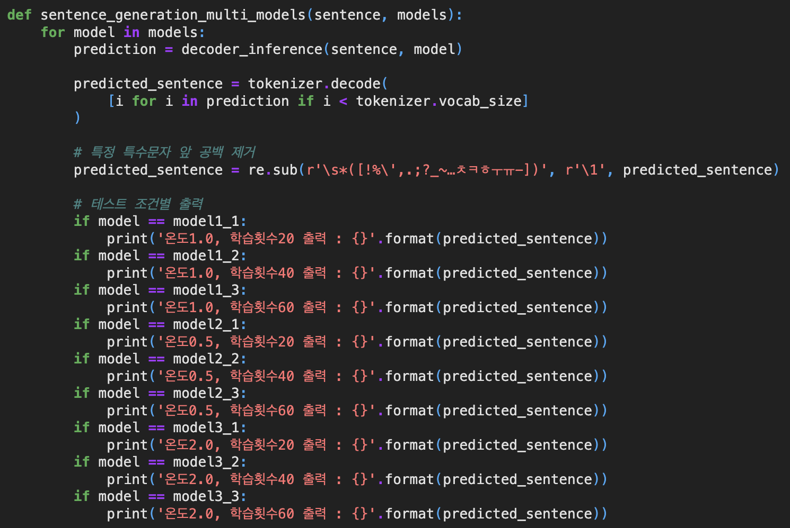

AIFFEL Campus Online Code Peer Review Templete

* 코더 : 오창원
* 리뷰어 : 홍예린

# PRT(Peer Review Template)
- [X]  **1. 주어진 문제를 해결하는 완성된 코드가 제출되었나요?**
    - 온도와 학습 횟수를 조절하여 실험을 완료함
    
    
- [X]  **2. 전체 코드에서 가장 핵심적이거나 가장 복잡하고 이해하기 어려운 부분에 작성된 
주석 또는 doc string을 보고 해당 코드가 잘 이해되었나요?**
    - 한국어 데이터를 전처리하면서 추가적으로 사용한 정규화 표현에 주석을 남겨 이해가 쉬웠음
    
        
- [X]  **3. 에러가 난 부분을 디버깅하여 문제를 해결한 기록을 남겼거나
새로운 시도 또는 추가 실험을 수행해봤나요?**
    - Temperature 값을 `0.5`와 `2.0`로 추가적인 실험을 진행
    
    
        
- [X]  **4. 회고를 잘 작성했나요?**
    - 각 실험에 관련해서 분석한 결과와 의문점을 잘 기록
    
    
    - 마지막 `chatbot_transformer_temp_ep.ipynb`은 리뷰 직전 실험이 끝나서 함께 결과를 리뷰하며 분석함 + 추가됨
    
        
- [X]  **5. 코드가 간결하고 효율적인가요?**
    - 깔끔하고 알아보기 쉬웠음
    


# 회고(참고 링크 및 코드 개선)
```
- 소프트맥스 온도를 수정하여 실험을 한 부분이 인상적
- 소프트맥스 온도를 높인 실험에서 몇 번 위로봇이 너무 차갑게 대답을 생성해서 흥미로웠음
- `ㅋ`랑 `ㅎ`를 하나의 문자로 줄인 게 맞을까? 의논했는데 다시 한 번 고민해봐야 할 것 같다!!
```
